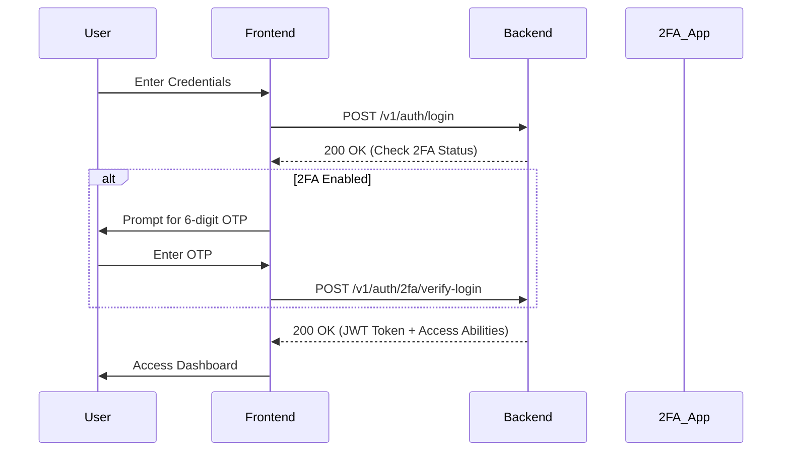
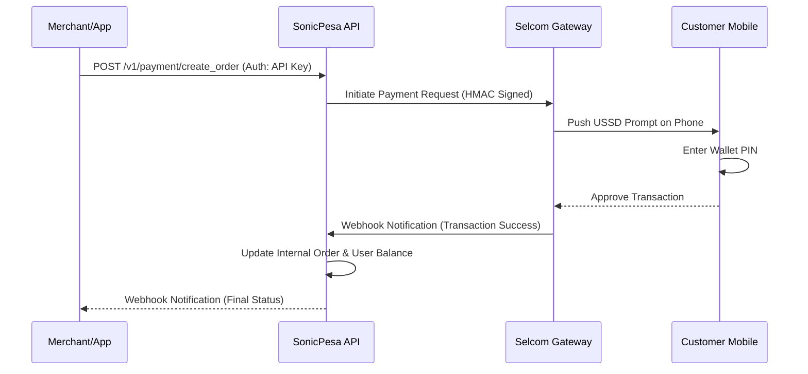
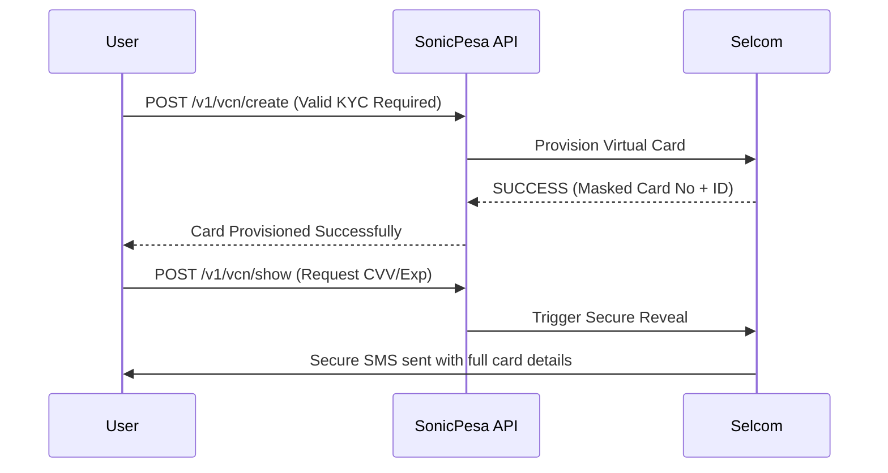

# Software Requirements Specification (SRS) - SonicPesa

**Version**: 1.0  
**Date**: April 19, 2026  
**Status**: Draft for Developer Review

---

## 1. Introduction
SonicPesa is a comprehensive financial technology platform designed to bridge the gap between traditional banking/mobile money and modern digital payments. It provides a robust set of APIs and dashboards for payment processing, virtual card management, and cross-border money transfers.

### 1.1 Purpose
This document provides a detailed overview of the system requirements for SonicPesa, including backend architecture, frontend interfaces, and external service integrations. It is intended for developers, stakeholders, and system integrators.

---

## 2. System Architecture
SonicPesa follows a decoupled Client-Server architecture:
- **Backend**: Laravel 12 (PHP 8.2+) providing a RESTful API.
- **Frontend (Merchant/User)**: React + Vite web application.
- **Admin Panel**: React + Vite dashboard for system monitoring and management.
- **Documentation**: Static HTML/JS portal for API integrators.

---

## 3. User Roles & Permissions

### 3.1 Super Admin
- Full access to system configuration and settings.
- Management of all registered users and their status (Activate/Deactivate).
- Oversight of all system-wide transactions and withdrawals.
- Approval/Rejection of KYC submissions.
- Direct communication via SMS and Email to users.

### 3.2 Merchant / Developer (Primary User)
- Access to the main dashboard for transaction tracking.
- API Key management (Generation, Rotation, Revocation).
- Payment Link creation and management.
- Virtual Card (VCN) lifecycle management.
- P2P transfers and Balance withdrawal.
- Security management (2FA, Profile updates).

### 3.3 End-User (Customer)
- Interacts with payment links created by Merchants.
- Receives SMS notifications for Push USSD authorizations.
- Interacts with Merchant platforms integrated with SonicPesa API.

---

## 4. Functional Requirements

### 4.1 Authentication & Security
- **JWT-based Auth**: Utilizes Laravel Sanctum for secure API authentication.
- **2FA (Two-Factor Authentication)**: Integrated via Google Authenticator (TOTP) for sensitive actions and logins.
- **Email Verification**: Mandatory email verification flow using secure tokens.
- **Identity (KYC)**: Three-tier verification system (Personal, Business, Domain) with document uploads (NIDA, TIN, Business License).

### 4.2 Payment Gateway Services
- **Push USSD**: Triggering direct payment prompts on mobile devices (M-Pesa, Airtel Money, TigoPesa, HaloPesa) via Selcom.
- **Payment Links**: Merchants can generate unique URLs to collect payments without custom code.
- **Order Management**: Real-time status tracking (PENDING, SUCCESS, CANCELLED, REJECTED).
- **Webhooks**: Automated POST notifications to merchant URLs on payment success or failure.

### 4.3 Virtual Card Number (VCN) Services
Integrated with Selcom VCN API to provide:
- **Card Provisioning**: Creation of virtual Mastercard/Visa cards linked to user fly-accounts.
- **Card Controls**: Temporary blocking, unblocking, or permanent suspension.
- **Limit Management**: Setting Daily, Monthly, or Per-transaction limits.
- **Secure Retrieval**: Secure SMS-based delivery of full card details to the owner.

### 4.4 Financial Movement
- **P2P Transfer**: Internal wallet-to-wallet transfers between SonicPesa users.
    - *Logic*: System verifies sender balance -> Checks recipient exists/active -> Debits Sender -> Credits Recipient -> Records immutable transaction log for both.
- **Withdrawals**: Automated and manual withdrawal requests.
    - *Logic*: User requests withdrawal -> Funds placed in PENDING_WITHDRAWAL -> Fee calculated -> Admin approves/Selcom processes -> Final balance deduction.
- **Qwiksend**: Bulk bank transfers to over 41 Tanzanian banks.
- **IMT (International Money Transfer)**: Support for cross-border remittances with full sender/recipient KYC data (Date of Birth, ID issued country, Occupation, etc.).

---

## 5. Technical Stack

### 5.1 Backend
- **Framework**: Laravel 12.x
- **Infrastructure**: Optimized for PHP 8.2+
- **Database**: 
    - Configuration supports SQLite (Development) and MySQL/PostgreSQL (Production).
    - Session and Cache drivers utilizing Database storage for stability across clusters.
- **Background Processing**: Laravel Jobs/Queues for webhook delivery and email sending.

### 5.2 Frontend
- **Library**: React 18+
- **Build Tool**: Vite
- **Styling**: TailwindCSS with Custom Glassmorphism components.
- **State Management**: React Context API for User and Notification states.

---

## 6. Integration Details

### 6.1 Selcom API Gateway
The core payment engine uses Selcom's HMAC-SHA256 signature scheme for:
- Utility Payments (LUKU, DSTV, GEPG).
- Wallet Cash-in/Cash-out.
- POS Terminal integrations.

### 6.2 Communication Gateways
- **SMS Service**: Integrated with Tanzanian messaging gateways for OTPs and transaction alerts.
- **Sender Configuration**: `kisekason` credentials/`SonicPesa` Sender ID.
- **SMTP Service**: Professional mail delivery for reports and security alerts (configured via spacemail.com).

---

## 7. Data Models (Core)
- **User**: Name, Email, Balance, Role, 2FA status, Webhook URL.
- **Transaction**: Order ID, Reference, Amount, Channel, Status, MSISDN.
- **VirtualCard**: Masked Card No, Card ID, Expiry, Status, Limit.
- **Kyc**: NIDA ID, TIN Docs, Business License, Verification Status.
- **ApiKey**: Public Key, Secret Hash, Name, Type (Live/Test).

---

## 8. API Overview
- **Base URL**: `https://api.sonicpesa.com/api/v1`
- **Auth Header**: 
    - `Authorization: Bearer <TOKEN>` (For dashboards)
    - `X-API-KEY: <KEY>` (For external integrations)
- **Response Format**: JSON only.

---

## 9. System Flows (Visual Documentation)

### 9.1 Authentication & 2FA Flow

### 9.2 Payment Processing Flow (Direct Push USSD)

### 9.3 Virtual Card (VCN) Lifestyle Flow

---

## 10. Security & Compliance

### 10.1 Webhook Signature Verification
Merchants **must** verify that notifications come from SonicPesa.
- *Mechanism*: HMAC-SHA256 signature.
- *Header*: `X-SonicPesa-Signature`.
- *Verification*: `hash_hmac('sha256', rawPayload, apiSecret)`.

### 10.2 API Rate Limiting
To prevent abuse, the backend implements a tiered throttling system:
- `auth:sanctum` endpoints: 60 requests/minute.
- `api-key` endpoints: 100 requests/minute (Customizable per merchant).
- `kyc/submit`: 10 requests/day.

### 10.3 Error Strategy
The API returns standard HTTP status codes:
- `200/201`: Success.
- `400`: Business logic error (e.g., Insufficient funds).
- `401/403`: Auth/Permission failure.
- `422`: Validation error (JSON format with field-level details).

---

## 11. Appendix: Endpoints List
(Refer to Swagger/Postman collection for full parameter details)

| Endpoint | Method | Role | Purpose |
| :--- | :--- | :--- | :--- |
| `/v1/auth/login` | POST | All | User entry |
| `/v1/payment/create_order` | POST | Merchant | Collect funds |
| `/v1/user/profile` | GET/POST | Merchant | User details |
| `/v1/admin/users` | GET | Admin | System oversight |
| `/v1/vcn/create` | POST | User | Provision card |

---

*End of Document*
